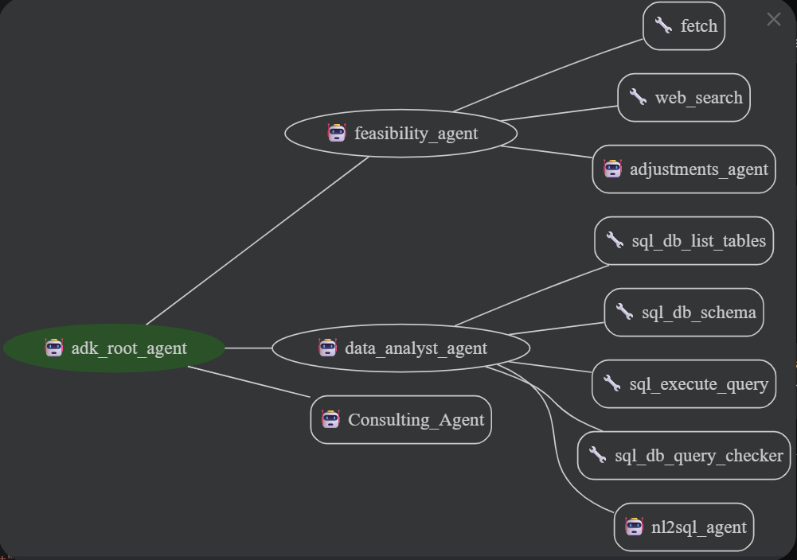
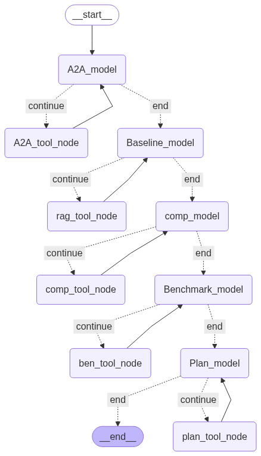
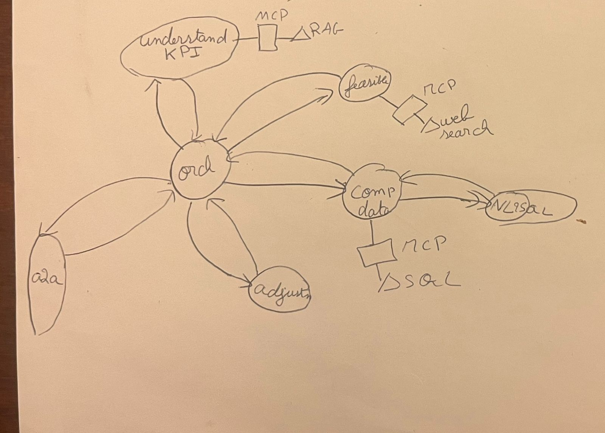
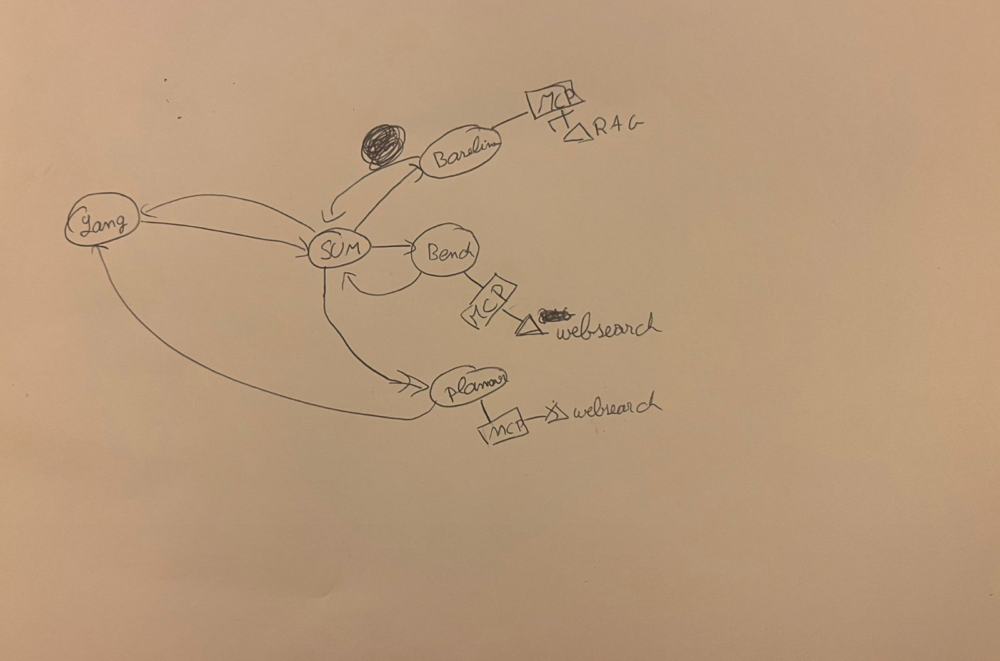

# Final_Project_Inmind — Multi-Agent Analytics & Strategy Stack
*(ADK × LangGraph × MCP with shared RAG, web tools & SQL toolkit)*

> A composable “consulting assistant” that answers KPI questions from your SQLite DB and crafts grounded strategies by combining internal RAG with external web research—all through one cohesive workflow.

## check list: ✓ ✗

1. Langgraph system:  ✓
2. Adk system: ✓
3. A2A Protocol: ✓
4. Tool Server MCP: ✓
5. Rag: ✓
6. Rag evaluation: ✓ (cosine similarity and simple llm as a judge)
7. evaluation: dk if it can be considered, unit tested all of the sub parts of the project, literally from the simplest tool and api key. However, testing was mostly manual and made through ppersonal observations.
8. SQL toolkit: ✓
9. Fast API: ✓
10. UI: ADK web (literally no benefits in using Gradio or chainlit in my project since i had both adk web and fast api)
11. Automatic Tracing with langfuse: ✓
12. Simple Fine-Tuning: ✓ (but not as a part of the workflow)

---
## Table of Contents
- [What this project does](#what-this-project-does)
- [Core components](#core-components)
  - [1) MCP Server (SSE)](#1-mcp-server-sse)
  - [2) Data layer](#2-data-layer)
  - [3) ADK agents (exposed over A2A)](#3-adk-agents-exposed-over-a2a)
  - [4) LangGraph “Consultant” workflow](#4-langgraph-consultant-workflow)
- [Rag](#Rag)
- [Configuration & environment](#configuration--environment)
- [Project Timeline (Most Important Part)](#Project-Timeline)

---

## What this project does

This project wires together two agent frameworks—**Google ADK** and **LangGraph**—so they can share the same tools (via an **MCP server**) and cooperate on two main jobs:

1. **KPI analytics Q&A (NL → SQL → answer)**: turn natural-language questions into safe SQLite queries over `monthly_kpis`, run them, and return results.  
2. **Strategy & research workflow**: pull internal context via RAG, scan competitors on the web, fetch and validate sources, benchmark, and synthesize a plan.

The result is a composable “consulting assistant” that can reason over your data and the web using the same toolbelt.

# Core components

## 1) MCP Server (SSE)

A single MCP server (“**combined-fast-mcp**”) exposes shared tools to both agent stacks.

### rag_tool
- **Vector DB**: FAISS at `data/rag_documents/faiss_index`  
- **Embeddings**: `BAAI/bge-small-en-v1.5`  
- **LLM**: `gemini-2.0-flash`  
- **Retriever**: similarity score threshold **0.5**  
- **Guardrails (enforced in tool)**: *Use ONLY retrieved text; if recall is weak, say “I don’t know.”*

### Web utilities
- `web_search`: search the web and retieves relevant urls 
- `fetch` (HTTP fetch) + `http_get_text`, `looks_like_html`, `html_to_markdown`: fetch the content found inside the urls.

### SQL ToolKit 
- List Tables.
- Table Schema.
- Execute Query.
- Validate Query.

**Transport**: Server-Sent Events (SSE), e.g. `http://localhost:8787/sse` (as used in code).

---
## 2) Data layer

- **SQLite DB:** Company_data.db  
- **Query rule:** Treat months as lexical ranges (for example, filter months using lexical start/end ranges).  
- **Company profile,:**  Overview of the company, policies/constraints, tactics, experiments log, KPI definitions, data dictionary, and related documents. (Mostly used by the RAG)

---

## 3) ADK agents
  
- **Agents:** Orchestrator (root_agent), Data Analyst Agent, nl2sql Agent, Feasibility Agent, Adjustment Agent, and Consultant Agent.  

**Workflow Explanation**
- `adk_root_agent` is the orchestrator that communicate the flow of the workflow. It is connected to 3 agent tools: Feasibility agent, data analyst agent, and Consulting Agent.
- `data analyst agent` is the agent connected to the sql toolkit, it's job it to gather data regarding the user's company by using the sql toolkit on tabular data.
- `feasibility agent` connected to the web search and fetch tools, this iis agent's role is check and asses the feasibility of the client's goal. And in case the goal was labeled as non feasible, call the adjustment agent to provide a more reasonable goal.
-`Consultant` is the langgrapha agent communicating with the root agent through a2a.

---

## 4) LangGraph workflow

- **Overview:** A streaming LangGraph application orchestrates research and synthesis across nodes.

**Nodes**
- **Baseline node:** Connects to the MCP RAG to gather internal, policy-constrained facts relevant to the user’s goal.  
- **Competitor node:** Uses web search to discover likely competitors, then fetches pages and validates content.  
- **Benchmark node:** Deep-dives on selected competitors using the same web toolchain to extract practices, pricing, positioning, and other evidence.  
- **Plan Node:** Using the web search and fetch tool, develops a strategy to reach the user's goal.

**A2A exposure:** The Langgraph agents are published via A2A so external clients (in this case adk) can call them as remote tools.

---
# Rag
- **Embedding:** BAAI/bge-small-en-v1.5
- **Model:** gemini-2.0-flash, gemma-3-270m-it (weak performance, discoverd lm studio)
- **Evaluation**: evaluated by applying cosine similarity with provided data of a more advance model, gpt-5.

---
# Configuration & environment
**Environment variables used by the stack**
- GOOGLE_API_KEY  
- OPENAI_API_KEY
- LANGFUSE_SECRET_KEY
- LANGFUSE_PUBLIC_KEY
- WANDB_API_KEY (for fine tuning only)

---
# Project Timeline
## Initial Research
- Before the project started, I had already researched and implemented a small test a2a project. However, the method used to expose the langgraph agent (by creating an adk agent inside the langgraph code and adding the compiled graph as a tool inside it, and then exposing this adk agent through a2a) even though fast and simple, had a couple of limitations and didn't abide to the project's rules as technically this became adk to adk communication, however, this method still allows communication of 2 agents on different devices.

- The first step was researching a topic idea that was: **feasible** in the required time, **complex enough** to learn and display what I had learned, and finally something I was **interested in**.

## Schema
- Once I got the approval, the first step was developping a manual schema. This schema helped me assess the required agents, tools, and connections. It also helped me assess possible limitations, and determine the required synthetic data for the project. 

1st schema of the adk workflow.

Changes Made:
- Removed the **a2a node** since the orchestrator was enough and an additional a2a node didnt bring any additional value (I can directly connect the langgraph agent to the orchestrator)

- **Adjustment node** Agent tool of feasible instead. adjustments should only be made after the feasibility was assessed therefore it was logical to put it as a tool for the feasible node.

- **Removed Understand Kpi node** the model is smart enough to understand the kpis alone without a rag pulling from some documents. **NOTE:** If more complex and complicated kpis are to be used, a rag and understand kpi node might be necessary.

1st schema of the langgraph workflow.

Changes made: 
- added a **competitor node** to properly find the best set of competitors for the benchmark. **Benefits:** more structured and better results since each task has a model's full attention and it ensured the bemchmark is going to be based on a list of competitors.

- Removed the **summarizer node** (SUM) and **Lang node**. Also made the graph sequential since each node is called in a specific order and at this point I made up my mind the orchestrator is going to be part of the adk workflow.

## Synthetic Data
To test the project, and for the project to actually. Accurate data was needed. Since pulling an actual company's data might be ineffient. Relied on a newer model gpt-5 to generate the needed synthetic data.

## MCP & Tools

My strategy to code this project was a bottom up approach (coding the small tools and agents and testing all of them through unit testing before creating the main agents). Therefore, the first part coded was the mcp along with its tools.

### Major steps:
#### web search and fetch:
- Since both workflows had to use a tool to access the web, I knew I couldnt use a simple adk built in tool. Therefore, by researching the mcp examples, I came to discover the fetch tool. The fetch tool takes as an input a url and retrieves its content through multiple steps and functions (similar to web scraping but a very simple web scraping), this allowed me to limit my token usage since it required neither an api key nor a model to run.

- However, I still needed to gather the urls, therefore I first tried the openai web search tool. The issue encountered was that the tool wasn't only gathering urls but also fetching info, therefore neglecting the fetch tool and giving weaker results.

- Through additional research, I found an implementation of a web search tool that only outputed url, the perfect tool in my case.

#### Sql Toolkit:
- By researching implementations of sql tools, I found the langchain sql toolkit, however, from its documentation, it was obvious difficulties will be encoutered if I try to use it for an adk agent, Therefore by trying to research an older version of the dcoumentation, I came upon a version (provided by langchain) that had the code of each tool inside. Through minimal adjustments, the sql toolkit was directly working with an sql agent.

- While testing, an issue I encountered was the sql toolkit not providing a tool that actually wrote an sql, and when the same agent that had the tool wrote the sql, it was hard to prompt it to evaluate itself, therefore, to overcome this problem, I created a Natural Language to sql agent, whose sole job is to translate the user prompt into an sql query.

## ADK workflow:
Since I didnt need any additional tool to implement the adk workflow, I started with it to have a working subpart.

Issues encountered: The orchestrator agent wasn't using its tools, answering the user prompt by itself even when specifically stated to use its tools.

Solution: Adjusted prompt, and created kind of state inside the prompt with bullet points that had to be filled by specific sub agent.

Result: Most of the time actullay using all of the tools, sometimes but very rarely asking for user input or simply answering by itself mid workflow.

## Rag:

- First researched how to build a rag. Next, my aim was to use a local model and avoid using api keys (worked for the embedding). While researching methods to do so, found lm studio, an app that allows me to download, test, and host models locally. Dowloaded the new gemma-270m model, tested it, and came into several issues. Since I was limited by time, and gemma-270m underperformed during testing, relied on google api call to prioritize time and to avoid downloading another bigger model.

- Tested the rag by first using llm as a judge (rag_testing.py), giving gpt-5 the results of the rag and letting him evaluate the answers compared to his, then by using cosine similarity with data provided by more advanced model (gpt-5)(evaluate.py). Had to switch chunking size several times (initially either too small or too large) to get adequate results

- Encountered a coule of issues while adding it to the mcp, but ended up being simpler than expected.

- Tested on a small langgraph node, worked perfectly

## Langgraph workflow:
Encoutered small issue due to mcp being connected through sse.
Once solved no issues were faced. Langfuse was added to track some of the agent's metrics. A large amount of tokens was intially used since I was using gpt-5 in one of the nodes --> downgraded to gpt-40-mini.

## A2A Protocol:
upon research, I realised adk is a lot more A2A friendly compared to langgraph, it has a to_a2a function that directly runs an adk agent in a sever and gives it an agent card and skill, and the RemoteA2aAgent built in class that allows you to use an external a2a agent running on a server as if it was a normal agent.

In the case of langgraph, this was a completly different story. Tested multiple links, articles, and documentations in vain. Came upon an article that used agent cards, and sent messages through http. After a full day of testing multiple methods, realised the only way for a2a to work with langgraph was creating an agent card and a2a server manually for the langgraph agent. Honestly, Chatgpt was used for exception handling, debugging, and trying to traceback the errors.

## Finetuned model:
Finetuned a simple llm model just for the sake of learning, sadly couldnt find a use case for my project without requiring huge data and fine tuning a large llm model.

Used gpt-2 with twitter sentiment exctraction dataset. 

Evaluated the model's performance on new data. Several issues due to the model being very simple. ex: the model was initially answering with multiple repeating words (ex if positive tweet, happyhappyhappy multiple times), sometime answering the tweets instead of classifying them (ex: the customer service is horrible, gpt2: sorry, changes will be made...)

Tried to improve the prompt (only answer with a single word... classify the following as on of th three only...), tried also to limit the number of output tokens to avoid the repeated word problem. Did see some positive changes.

Note that regardless of the stated issue, the fine tuned model was still, most of the time, classifying the tweets properly (even though as happyhappy multiple times)

Couldn't connect to fast api without huge changes or without severly delaying fast api launch.

## Fast Api:
- Some issues were encountered while trying to connect the orchestrator to an endpoint. Difficulty trying to understand how sessions and adk runner works
- Rag was suprisingly easy to connect.
- Didn't connect the langgraph workflow alone since it was already tested during unit testing, and connecting to an endpoint might require way too much time.
